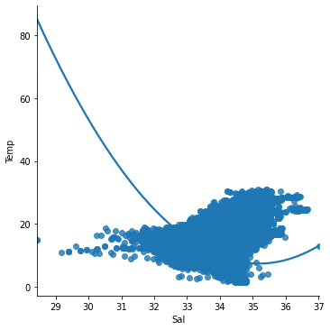
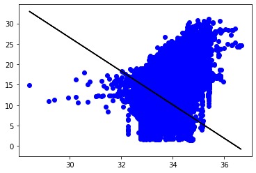
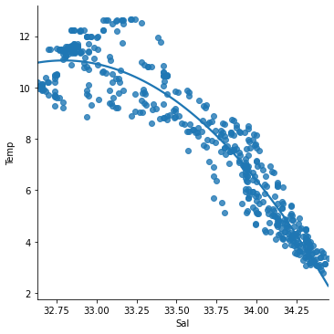
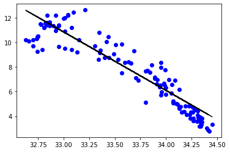

```python
import os
os.getcwd()
```


    'C:\\Users\\tamil'


```python
import numpy as np
import pandas as pd
import seaborn as sns
import matplotlib.pyplot as plt
from sklearn import preprocessing, svm
from sklearn.model_selection import train_test_split
from sklearn.linear_model import LinearRegression
```


```python
df = pd.read_csv('bottle.csv')
df_binary = df[['Salnty', 'T_degC']]
```

    C:\Users\tamil\anaconda3\lib\site-packages\IPython\core\interactiveshell.py:3146: DtypeWarning: Columns (47,73) have mixed types.Specify dtype option on import or set low_memory=False.
      has_raised = await self.run_ast_nodes(code_ast.body, cell_name,
    


```python
df_binary.columns = ['Sal', 'Temp']
```


```python
df_binary.head()
```


<div>
<style scoped>
    .dataframe tbody tr th:only-of-type {
        vertical-align: middle;
    }

    .dataframe tbody tr th {
        vertical-align: top;
    }

    .dataframe thead th {
        text-align: right;
    }
</style>
<table border="1" class="dataframe">
  <thead>
    <tr style="text-align: right;">
      <th></th>
      <th>Sal</th>
      <th>Temp</th>
    </tr>
  </thead>
  <tbody>
    <tr>
      <th>0</th>
      <td>33.440</td>
      <td>10.50</td>
    </tr>
    <tr>
      <th>1</th>
      <td>33.440</td>
      <td>10.46</td>
    </tr>
    <tr>
      <th>2</th>
      <td>33.437</td>
      <td>10.46</td>
    </tr>
    <tr>
      <th>3</th>
      <td>33.420</td>
      <td>10.45</td>
    </tr>
    <tr>
      <th>4</th>
      <td>33.421</td>
      <td>10.45</td>
    </tr>
  </tbody>
</table>
</div>


```python
sns.lmplot(x ="Sal", y ="Temp", data = df_binary, order = 2, ci = None)
```


    <seaborn.axisgrid.FacetGrid at 0x21f2e92bd00>


    

    


```python
df_binary.fillna(method ='ffill', inplace = True)
```

    C:\Users\tamil\anaconda3\lib\site-packages\pandas\core\frame.py:4317: SettingWithCopyWarning: 
    A value is trying to be set on a copy of a slice from a DataFrame
    
    See the caveats in the documentation: https://pandas.pydata.org/pandas-docs/stable/user_guide/indexing.html#returning-a-view-versus-a-copy
      return super().fillna(
    


```python
X = np.array(df_binary['Sal']).reshape(-1, 1)
y = np.array(df_binary['Temp']).reshape(-1, 1)
```


```python
df_binary.dropna(inplace = True)
```

    <ipython-input-9-ad90ac1a68eb>:1: SettingWithCopyWarning: 
    A value is trying to be set on a copy of a slice from a DataFrame
    
    See the caveats in the documentation: https://pandas.pydata.org/pandas-docs/stable/user_guide/indexing.html#returning-a-view-versus-a-copy
      df_binary.dropna(inplace = True)
    


```python
X_train, X_test, y_train, y_test = train_test_split(X, y, test_size =
0.25)
```


```python
regr = LinearRegression()
regr.fit(X_train, y_train)
print(regr.score(X_test, y_test))
```

    0.20348530495366235
    


```python
y_pred = regr.predict(X_test)
plt.scatter(X_test, y_test, color ='b')
plt.plot(X_test, y_pred, color ='k')
```


    [<matplotlib.lines.Line2D at 0x21f3463bee0>]


    

    


```python
df_binary500 = df_binary[:][:500]
```


```python
sns.lmplot(x ="Sal", y ="Temp", data = df_binary500,order = 2, ci = None)
```


    <seaborn.axisgrid.FacetGrid at 0x21f3466aaf0>


    

    


```python
df_binary500.fillna(method ='ffill', inplace = True)

X = np.array(df_binary500['Sal']).reshape(-1, 1)
y = np.array(df_binary500['Temp']).reshape(-1, 1)

df_binary500.dropna(inplace = True)
X_train, X_test, y_train, y_test = train_test_split(X, y, test_size =
0.25)

regr = LinearRegression()
regr.fit(X_train, y_train)
print(regr.score(X_test, y_test))
```

    0.8704193098904595
    


```python
y_pred = regr.predict(X_test)
plt.scatter(X_test, y_test, color ='b')
plt.plot(X_test, y_pred, color ='k')
plt.show()
```


    

    


```python
s
```
